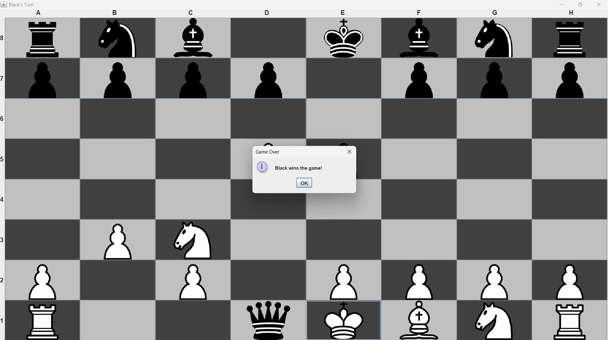

VOLDEMORT-

Arseniy
Tallon
Glohan
Havish

Fall 2024, CS 3354.006

• One or more preview pictures to showcase the GUI Chess game interface.

• Display the Class Diagram.

• Instructions on how to compile, start, and run the chess game

1. All pieces are placed at correct position and move and capture pieces based on proper chess rules
2. Alternate turns
3. Game ends when a player capture opponents king